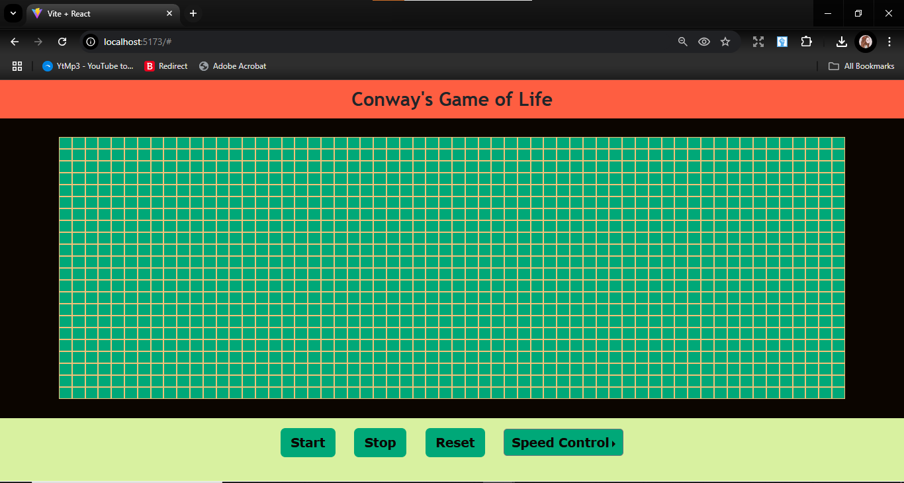
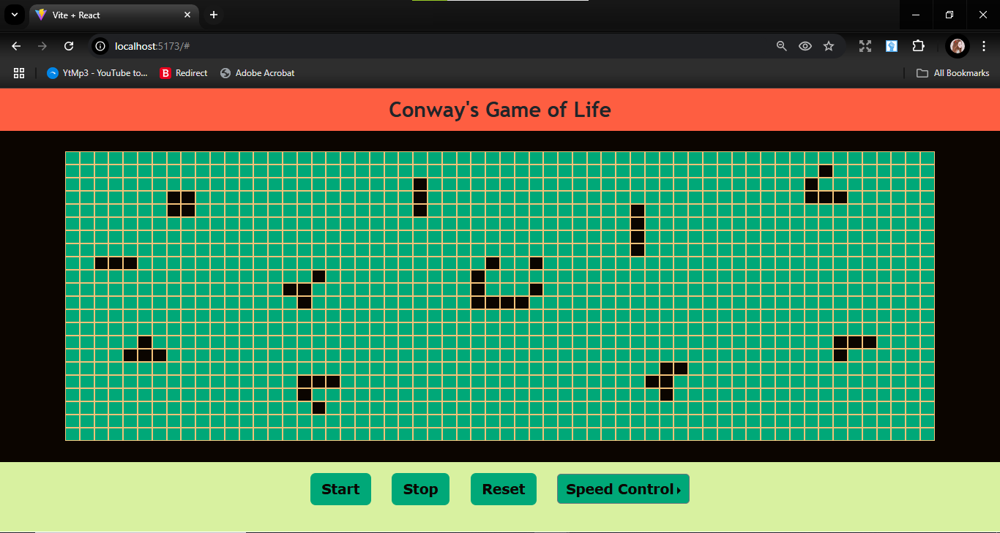
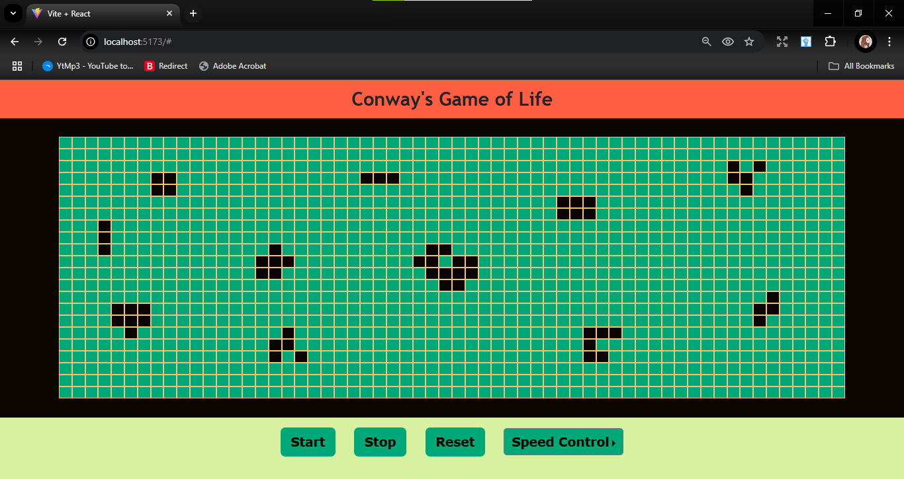
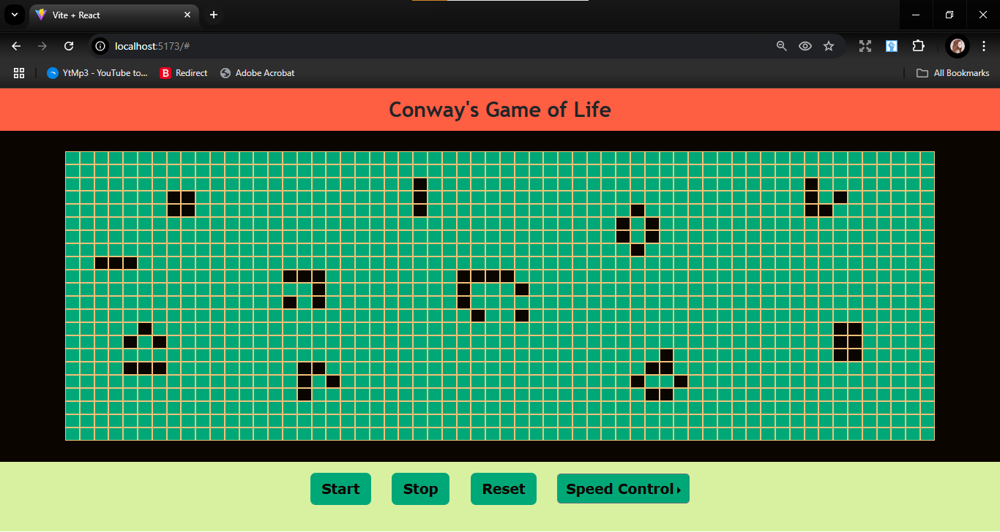
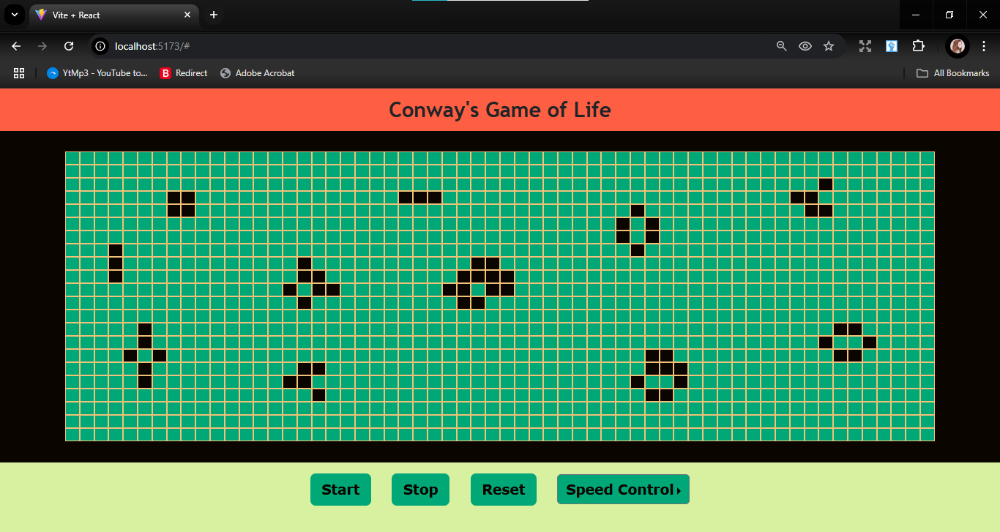
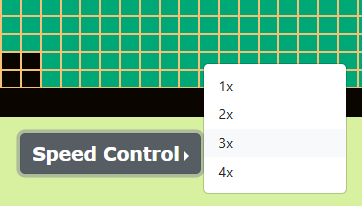
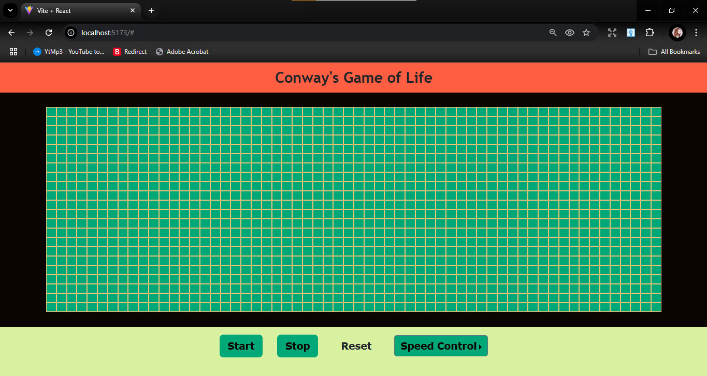

# Interactive Grid Simulation

## Project Description
This project is an interactive grid simulation that demonstrates real-time grid updates and speed control. Inspired by Conway's Game of Life, it allows users to toggle the state of cells and observe the evolution of the grid over time at different speeds (1x, 2x, 3x, and 4x).

## Technologies Used
- **ReactJS**: For building the user interface and managing the state of the grid.
- **JavaScript**: For logic and dynamic updates.
- **Bootstrap**: For responsive design and UI elements.
- **HTML/CSS**: For structuring and styling the app.

## Screenshots
Initial State: 

Running State 1:

Running State 2:

Running State 3:

Running State 4:

Control Panel:

Speed Control: 

Use of Reset:


## Video Demonstration
[Watch the video on YouTube](https://www.youtube.com/watch?v=2OZWzTtCj6c)


## How to Run the Project
1. Clone this repository to your local machine.
2. Navigate to the project directory in your terminal and run the following commands:
   ```bash
   npm install
   npm start

# React + Vite

This template provides a minimal setup to get React working in Vite with HMR and some ESLint rules.

Currently, two official plugins are available:

- [@vitejs/plugin-react](https://github.com/vitejs/vite-plugin-react/blob/main/packages/plugin-react/README.md) uses [Babel](https://babeljs.io/) for Fast Refresh
- [@vitejs/plugin-react-swc](https://github.com/vitejs/vite-plugin-react-swc) uses [SWC](https://swc.rs/) for Fast Refresh
